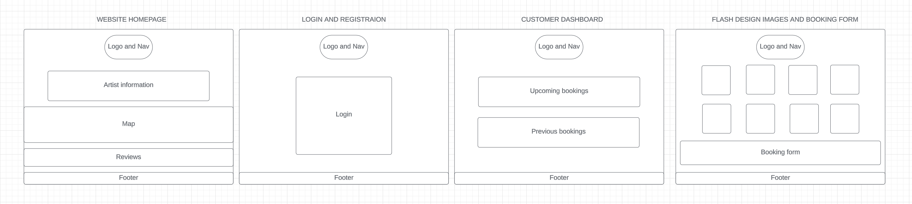

# Bee Inkspired 

Bee Inkspired is the homepage for Olivia Harper's tattoo business, it showcases her work and allows her and her customers a place to manage appointment bookings and deal with enquiries. The website is themed around her brand and logo.

The live link can be found [here](https://bee-inkspired-a51d6678dda0.herokuapp.com/)!

# Table of Contents
- [Bee Inkspired](#bee-inkspired)
  * [User Experience (UX)](#user-experience--ux-)
    + [User Stories](#user-stories)
      - [Goals for the user](#goals-for-the-user)
      - [Goals for the Artist](#goals-for-the-artist)
    + [Design](#design)
      - [Wireframes](#wireframes)
  * [Features](#features)
    + [Future features](#future-features)
  * [Agile Methodology](#agile-methodology)
  * [Data](#data)
  * [Security features](#security-features)
    + [User Authentication](#user-authentication)
    + [Database](#database)
  * [Testing](#testing)
    + [Testing MVC Framework](#testing-mvc-framework)
    + [Code](#code)
      - [HTML Testing](#html-testing)
      - [CSS Testing](#css-testing)
      - [Pylint](#pylint)
      - [Javascript](#javascript)
    + [User Experience](#user-experience)
  * [Bugs](#bugs)
  * [Creating the website](#creating-the-website)
    + [Languages](#languages)
    + [Frameworks, Libraries and Programs](#frameworks--libraries-and-programs)
  * [Installing](#installing)
    + [Create the Heroku App](#create-the-heroku-app)
    + [Attach the Postgres database](#attach-the-postgres-database)
    + [Prepare the environment and settings.py file](#prepare-the-environment-and-settingspy-file)
    + [Create files/directories](#create-files-directories)
    + [Update Heroku Config Vars](#update-heroku-config-vars)
    + [Deploy](#deploy)
  * [Forking this repository](#forking-this-repository)
  * [Cloning this repository](#cloning-this-repository)
  * [Credits](#credits)
    + [Media](#media)
    + [Code](#code-1)

<small><i><a href='http://ecotrust-canada.github.io/markdown-toc/'>Table of contents generated with markdown-toc</a></i></small>

## User Experience (UX)

The user target market is adults who are interested in a new tattoo, either for a flash design or they want to contact an artist to discuss a design they have in mind. 

### User Stories
 
GitHub issues custom template feature is used for User Stories, it is crucial to the creation and development of this project.

One user story was scoped for customers to pay a deposit before their booking is secure, this was labelled as 'Won't Have' and is not currently a feature on the site.

#### Goals for the user

- Learn about the artist and view their previous work
- Easy to locate the studio 
- Link to the artist social media
- Register and log in with simple authentication process
- View a personalised dashboard to see personal details and upcoming bookings
- Send an enquiry with a reference image to the artist

#### Goals for the Artist

- Dashboard to show only upcoming bookings
- Have a section to show outstanding enquires 
- Delete enquiries to keep dashboard organised and current
- Have customer reviews show up on home page to help promote business

### Design 

The theme is consistant through the site, mainly tailored around being dark and Gothic much like her studio. 
The yellow font (#cfb442) was chosen using a colour picker on her logo to ensure the website represents her brand exactly.
The font was chosen to compliment her logo rather than match it, as the font needed to be bolder to stand out against the dark background. The chosen font is Bricolage Grotesque imported via Google Fonts with a backup of Sans Sarif.

#### Wireframes

The website has stuck to its original wireframe design, but more pages had to be added than what was in the scope. The additional pages were form pages such as the enquiry form and customer review page which follow the login page wireframe to help with consistent styling.

## Features

As a B2C site, the final aim is to impress customers to book a tattoo or make an enquiry. The site needs to be easy to navigate and comprehensive in the information given on Olivia, her skills and the studio.

Current features fulfil all the user goals for the website as well as an additional feature allowing customers to leave a review for a previous booking on their dash that will then be automatically displayed on the homepage.

### Future features

- Users will need to pay a deposit to secure their booking.
- Times slots added to bookings so there can be multiple flash tattoos in a day if the artist has no other tattoos scheduled for that day.
- Users dashboards will have status updates for any enquiries they send
- Time limit for when users can update their booking
- Admin can approve reviews before they get displayed on the homepage incase they are unprofessional, eg contain foul language.

## Agile Methodology

After using GitHub's issues to create the User Stories, these where then put onto the projects GitHub project board, which can be viewed [here](https://github.com/users/debbie-herridge/projects/11/views/1). An addition colomn was added for 'current iteration' to display which Epics where being worked on in the current Milestone.

## Data

The diagram below shows the data schema and shows the models relationships with each other.

## Security features

### User Authentication

There are custom decorators used to ensure the webpage is only access if permission is given.

1. Unauthenticated user - this decorator checks if a user is logged in and if are they will not be able to see the login or register page.
2. Allowed users - this decorator will stop admin seeing the customers dashboard, and customers seeing the admin dashboard.

### Database 

The database url and secret key are stored in the env.py file to prevent unwanted connections to the database and this was set up before the first push to Github.

Cross-Site Request Forgery (CSRF) tokens were used on all forms throughout this site.

## Testing

### Testing MVC Framework

The MVC framework is present in both the customer and artist dashboard where the view is fetching data from the model and displaying them. When customers update their profile details or their booking these changes are then sent to the controller which will then update the view accordingly.

### Code

#### HTML Testing

HTML was tested using [W3 Validator](https://validator.w3.org/nu/?doc=https%3A%2F%2F8000-debbieherri-beeinkspire-roezq58cv31.ws-eu107.gitpod.io%2F). It passed with two warnings.

#### CSS Testing 

The CSS was tested using [W3C Validator](https://jigsaw.w3.org/css-validator/validator) and passed.

 
#### Pylint

Python code was tested using Pylint, installed in the terminal using **pip install pylint** and ran using the command **pylint $(git ls-files '*.py')**. 

The Python code was rated 5.98 out of 10, after an initial rating of 5.53. Improvements were made by removing any trailing whitespaces and adding final new lines. The majority of the errors were due to lines being too long in migrations and using wildcard imports for models and forms.

#### Javascript

The project only uses Javascript to integrate an interactive map from Google using an API key. The map worked perfectly in the local environment however once deployed to Heroku it no longer displayed as previously. The error was due to **RefererNotAllowedMapError**. To attempt to solve this the deployed link was added to the list of allowed referrers for that API key on Google Cloud. However the map was inserted in using an iframe as recommended by the Code Institute tutor support team. This allowed the map to render on the website but not using JavaScript.

### User Experience

Testing user experience was done extensively. This involved testing links from different pages and making sure it was unnecessary for a user to have to scroll far or struggle to find their way back to the previous page. 

Several people where asked to make accounts, add bookings and enquiries, and amend their booking and profile. The only critative feedback that was given that the errors given for the registration were not easy to read, therefore a custom error message was added which is more reader friendly to the user. Many people commented that they liked that the image container for the forms and dashboard were consistant with the font and styling.

User stories where crucial to this testing to ensure that user experience using the website was seemless and easy to navigate.

Lighthouse on Google Dev tools was used to test the load time for the site, it received a score of 84.

## Bugs

The DateField in the booking model caused many bugs and needed plenty of troubleshooting. As the form to create a booking is made with a custom date field to only display the upcoming 2 weeks, this was not included in the form using the Django form template. Therefore this data then had to be modified from strftime, which makes the date more user friendly, back into strptime to be saved onto the booking model.

[This article](https://docs.python.org/3/library/datetime.html#strftime-and-strptime-behavior) from Python.org was extremely helpful in solving the issue.

A bug following on from the above was iterating through the list of dates and removing the booked dates so that users could not select those from the custom date field in the booking form. [This article](https://www.geeksforgeeks.org/python-remove-all-values-from-a-list-present-in-other-list/) from GeeksForGeeks helped understand how to iterate through one list and remove any matching data in another list.

## Creating the website

The project was created on Gitpod and pushed to GitHub, the Data is stored with ElephantSQL and media is stored in Cloudinary, both linked with API's to the project. The website is then deployed to create the app using Heroku.

### Languages

- HTML
- CSS
- PYTHON
- JAVA

### Frameworks, Libraries and Programs

- [Django](https://www.djangoproject.com/) 
- [ElephantSQL](https://www.elephantsql.com/)
- [Cloudinary](https://cloudinary.com/ip/gr-sea-gg-brand-home-base?utm_source=google&utm_medium=search&utm_campaign=goog_selfserve_brand_wk22_replicate_core_branded_keyword&utm_term=1329&campaignid=17601148700&adgroupid=141182782954&keyword=cloudinary&device=c&matchtype=e&adposition=&gad_source=1&gclid=CjwKCAiA-P-rBhBEEiwAQEXhH2ndeczu952BxiEy0n2brT63DR2X09OuugdQMRhehy0gXScT3VM9VxoCldEQAvD_BwE) 
- [Heroku](https://www.heroku.com/)
- [Bootstrap 5](https://getbootstrap.com/)
- [LucidChart](https://lucid.app/)
- [Chrome Dev Tools](https://developer.chrome.com/docs/devtools)
- [Font awesome](https://fontawesome.com/)
- [Google fonts](https://fonts.google.com/)
- [GitHub](https://github.com/) 
- [GitPod](https://gitpod.io/workspaces)
- [Favicon](https://favicon.io/)
- [Pylint](https://pypi.org/project/pylint/)
- [Grammerly](https://www.grammarly.com/service/download)

## Installing

### Create the Heroku App
- Log in to Heroku or create an account.
- On the main page click the button labelled New in the top right corner and from the drop-down menu select "Create New App".
- Enter a unique and meaningful app name.
- Next, select your region.
- Click on the Create App button.

### Attach the Postgres database
- In the Resources tab, under add-ons, type in Postgres and select the Heroku Postgres option.
- Copy the DATABASE_URL located in Config Vars in the Settings Tab.

### Prepare the environment and settings.py file
- In your GitPod workspace, create an env.py file in the main directory.
- Add the DATABASE_URL value and your chosen SECRET_KEY value to the env.py file.
- Update the settings.py file to import the env.py file and add the SECRETKEY and DATABASE_URL file paths.
- Comment out the default database configuration.
- Save files and make migrations.
- Add Cloudinary URL to env.py
- Add the Cloudinary libraries to the list of installed apps.
- Add the STATIC files settings - the URL, storage path, directory path, root path, media URL and default file storage path.
- Link the file to the templates directory in Heroku.
- Change the templates directory to TEMPLATES_DIR
- Add Heroku to the ALLOWED_HOSTS list in the format ['app_name.heroku.com', 'localhost']

### Create files/directories
- Create requirements.txt file
- Create three directories in the main directory; media, storage and templates.
- Create a file named "Procfile" in the main directory and add the following: web: gunicorn beeinkspired.wsgi

### Update Heroku Config Vars
Add the following Config Vars in Heroku:

- SECRET_KEY value
- CLOUDINARY_URL
- PORT = 8000
- DISABLE_COLLECTSTATIC = 1

### Deploy

Ensure in Django settings, DEBUG is False

- Go to the deploy tab on Heroku and connect to GitHub, then to the required repository.
- Scroll to the bottom of the deploy page and either click Enable Automatic Deploys for automatic deploys or Deploy Branch to deploy manually. Manually deployed branches will need re-deploying each time the repo is updated.
- Click View to view the deployed site.

The site is now live and operational.

## Forking this repository

- Locate the repository at this [link](https://github.com/debbie-herridge/bee-inkspired)
- At the top of the repository, on the right side of the page, select "Fork" from the buttons available.

A copy of the repository is now created.

## Cloning this repository

- Locate the repository at this [link](https://github.com/debbie-herridge/bee-inkspired)
- Under 'Code', see the different cloning options, HTTPS, SSH, and GitHub CLI. Click the preferred cloning option, and then copy the link provided.
Open Terminal.
- In Terminal, change the current working directory to the desired location of the cloned directory.
- Type 'git clone', and then paste the URL copied from GitHub earlier.
- Type 'Enter' to create the local clone.

## Credits

### Media 

A big thank you to Olivia Harper for sending all the original material for me to create this project.

### Code

Thank you to [Dennis Ivy](https://www.youtube.com/watch?v=xv_bwpA_aEA&list=PL-51WBLyFTg2vW-_6XBoUpE7vpmoR3ztO) on Youtube for his in depth walk through of a booking project.
Also thank you to Code Institute's tutor support team for helping me out with the date issue in my booking form as mentioned in the above bugs section.